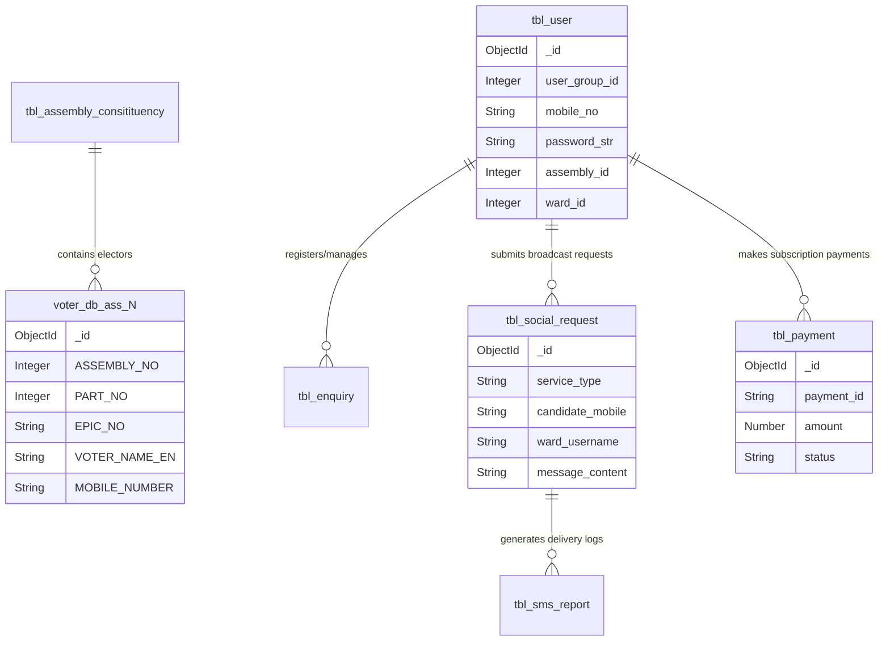

# Comprehensive Database & Schema Documentation

> **Server / Droplet IP**: `142.93.10.77`
> **Application**: Election Data Management System (EDM)
> **Database Architecture**: Multi-Database MongoDB Setup (Local Elector Database + Cloud Application Database)

---

## 1. Overview of Databases on the Droplet

The system utilizes **two distinct MongoDB databases** to isolate heavy electoral roll query loads from transactional app operations:

| Database Name              | Hosting Location                                         | Connection URI                | Primary Scope & Responsibilities                                                                                                                                       |
| -------------------------- | -------------------------------------------------------- | ----------------------------- | ---------------------------------------------------------------------------------------------------------------------------------------------------------------------- |
| **`voter_db`**     | **Local MongoDB** on Droplet (`127.0.0.1:27017`) | `mongodb://127.0.0.1:27017` | High-volume voter electoral rolls containing 234 Assembly collections (`ass_1` to `ass_234`) and sample demonstration dataset.                                     |
| **`election_app`** | **MongoDB Atlas** (Cloud Cluster)                  | `mongodb+srv://...`         | Application state, user accounts, candidate registrations, ward/booth logins, constituency master data, payment ledgers, broadcast requests, and media asset metadata. |

---

## 2. Database 1: `voter_db` (Local Droplet Database)

### 2.1 Assembly Voter Roll Collections (`ass_1` through `ass_234`)

* **Collection Pattern**: `ass_<assembly_no>` (e.g., `ass_1`, `ass_2`, ..., `ass_234`)
* **Total Collections**: 234 (one per Tamil Nadu Assembly Constituency)
* **Purpose**: Holds all registered electors per constituency. Indexed for high-speed EPIC, phone number, name, and demographic filter queries.

#### Collection Field Specifications

| Field Name           | BSON Data Type | Example Value                           | Description & Constraints                                 |
| -------------------- | -------------- | --------------------------------------- | --------------------------------------------------------- |
| `_id`              | `ObjectId`   | `669a8b1f...`                         | Unique MongoDB document identifier                        |
| `ID`               | `Integer`    | `10245`                               | Sequential Elector Serial ID                              |
| `ASSEMBLY_NO`      | `Integer`    | `2`                                   | Assembly Constituency Number (1 to 234)                   |
| `AC_NAME`          | `String`     | `"Ponneri"`                           | Assembly Constituency Name                                |
| `PART_NO`          | `Integer`    | `12`                                  | Polling Booth / Part Number                               |
| `BOOTH_NAME`       | `String`     | `"Panchayat Union Primary School..."` | Polling Station location and address                      |
| `SECTION_NO`       | `Integer`    | `1`                                   | Section / Street Number within booth                      |
| `SECTION_NAME`     | `String`     | `"Ward 1 Main Road"`                  | Section / Street Name                                     |
| `EPIC_NO`          | `String`     | `"ALF2230738"`                        | Voter EPIC Card Number                                    |
| `VOTER_NAME`       | `String`     | `"பிரியா தேவி"`             | Elector Name in Tamil                                     |
| `VOTER_NAME_EN`    | `String`     | `"Priya Devi"`                        | Elector Name in English                                   |
| `RELATION_TYPE`    | `String`     | `"Father"`                            | Relation type (`"Father"`, `"Husband"`, `"Mother"`) |
| `RELATION_NAME`    | `String`     | `"கார்த்திக்"`              | Relation Name in Tamil                                    |
| `RELATION_NAME_EN` | `String`     | `"Karthik"`                           | Relation Name in English                                  |
| `AGE`              | `Integer`    | `32`                                  | Elector Age                                               |
| `GENDER`           | `String`     | `"Female"`                            | Gender (`"Male"`, `"Female"`, `"Third Gender"`)     |
| `MOBILE_NUMBER`    | `String`     | `"9876543210"`                        | 10-digit Elector Mobile Phone Number                      |
| `HOUSE_NO`         | `String`     | `"12/4B"`                             | Door / House Number                                       |
| `LAT`              | `Double`     | `13.32451`                            | Latitude coordinate of polling location                   |
| `LNG`              | `Double`     | `80.19842`                            | Longitude coordinate of polling location                  |

#### Indexes on `ass_<n>`

```json
{
  "EPIC_NO": 1,
  "MOBILE_NUMBER": 1,
  "PART_NO": 1,
  "AGE": 1
}
```

---

### 2.2 `sample_voters` (Demonstration Dataset)

* **Purpose**: Preview dataset containing 705 sample voters across 47 booths used when a Ward Admin login has no assigned live booths (**Preview & Demonstration Mode**).
* **Schema**: Identical to `ass_<n>` collection fields (`EPIC_NO`, `PART_NO`, `VOTER_NAME_EN`, `RELATION_NAME_EN`, `AGE`, `GENDER`, `MOBILE_NUMBER`).

---

## 3. Database 2: `election_app` (MongoDB Atlas / App Database)

### 3.1 `tbl_user` (User Accounts & System Logins)

* **Purpose**: User accounts, authentication credentials, system roles, and assigned constituency scopes.

#### Collection Field Specifications

| Field Name         | BSON Data Type            | Description & Role Scoping                                                                                                                                                                                   |
| ------------------ | ------------------------- | ------------------------------------------------------------------------------------------------------------------------------------------------------------------------------------------------------------ |
| `_id`            | `ObjectId`              | Unique MongoDB document identifier                                                                                                                                                                           |
| `id`             | `Integer`               | Auto-incrementing numeric User ID                                                                                                                                                                            |
| `first_name`     | `String`                | User First Name / Ward display title                                                                                                                                                                         |
| `last_name`      | `String`                | User Last Name                                                                                                                                                                                               |
| `mobile_no`      | `String`                | Cleaned 10-digit mobile number / Username                                                                                                                                                                    |
| `email`          | `String`                | User Email Address                                                                                                                                                                                           |
| `password_str`   | `String` \| `Integer` | Plaintext passcode / hashed password                                                                                                                                                                         |
| `user_group_id`  | `Integer`               | **System Role Group ID**: • `1`: Super Admin • `2`: State / MP Admin • `3`: Candidate / MLA • `4`: Booth Admin • `5`: Campaign Team / Party Functionary • `6`: Local Body Ward Admin |
| `assembly_id`    | `Integer`               | Assigned Assembly Constituency Number                                                                                                                                                                        |
| `booth_id`       | `Integer`               | Assigned Booth / Part Number (for Group 4)                                                                                                                                                                   |
| `ward_id`        | `Integer`               | Assigned Ward Number (for Group 6)                                                                                                                                                                           |
| `district_id`    | `String` \| `Integer` | District Name / ID                                                                                                                                                                                           |
| `category_name`  | `String`                | Union / Municipality / Local Body Name                                                                                                                                                                       |
| `candidate_type` | `String`                | Body Type (`"urban"`, `"rural"`)                                                                                                                                                                         |
| `position`       | `String`                | Candidate Position (`"Corporation"`, `"Municipality"`, `"Town Panchayat"`, `"Panchayat Union"`)                                                                                                      |
| `paid_status`    | `String`                | Subscription Status (`"Yes"`, `"No"`)                                                                                                                                                                    |
| `transaction_id` | `String`                | Reference Transaction ID in`tbl_payment`                                                                                                                                                                   |
| `is_user_login`  | `Boolean`               | Flag differentiating main admin combination vs per-mobile user login                                                                                                                                         |
| `created_at`     | `String` (ISO 8601)     | Account creation timestamp                                                                                                                                                                                   |
| `updated_at`     | `String` (ISO 8601)     | Last update timestamp                                                                                                                                                                                        |

---

### 3.2 `tbl_enquiry` (Candidate Registrations)

* **Purpose**: Stores registration form submissions submitted by political candidates.

#### Collection Field Specifications

| Field Name                   | BSON Data Type            | Description                                                                                          |
| ---------------------------- | ------------------------- | ---------------------------------------------------------------------------------------------------- |
| `_id`                      | `ObjectId`              | Unique MongoDB document ID                                                                           |
| `full_name`                | `String`                | Full Name of Candidate                                                                               |
| `mobile`                   | `String`                | Candidate 10-digit Mobile Number                                                                     |
| `passcode`                 | `String`                | Random 6-digit access passcode                                                                       |
| `role`                     | `String`                | Candidate Role (`"planning"`, `"confirmed"`, `"team"`, `"functionary"`)                      |
| `affiliation`              | `String`                | Political Affiliation (`"affiliated"`, `"independent"`)                                          |
| `party`                    | `String`                | Political Party (`"DMK"`, `"AIADMK"`, `"BJP"`, `"INC"`, `"NTK"`, `"TVK"`, etc.)          |
| `district`                 | `String`                | Candidate District Name                                                                              |
| `body_type`                | `String`                | Local Body Type (`"urban"`, `"rural"`)                                                           |
| `position`                 | `String`                | Office Position (`"Corporation"`, `"Municipality"`, `"Town Panchayat"`, `"Panchayat Union"`) |
| `union_or_municipality`    | `String`                | Union or Municipality Name                                                                           |
| `panchayat_or_corporation` | `String`                | Panchayat or Corporation Name                                                                        |
| `ward_number`              | `String` \| `Integer` | Ward Number                                                                                          |
| `created_at`               | `String` (ISO 8601)     | Registration timestamp                                                                               |
| `updated_at`               | `String` (ISO 8601)     | Update timestamp                                                                                     |

---

### 3.3 `tbl_assembly_consitituency` (Assembly Constituency Master)

* **Purpose**: Master registry of all 234 Tamil Nadu Assembly Constituencies.

#### Collection Field Specifications

| Field Name              | BSON Data Type        | Description                                             |
| ----------------------- | --------------------- | ------------------------------------------------------- |
| `_id`                 | `ObjectId`          | Unique MongoDB document ID                              |
| `assembly_no`         | `Integer`           | Constituency Number (1 to 234)                          |
| `assembly_name`       | `String`            | Constituency Name (e.g.`"Ponneri"`, `"Perambalur"`) |
| `district`            | `String`            | District Name                                           |
| `district_id`         | `Integer`           | District Numeric Identifier                             |
| `parliament_id`       | `Integer`           | Parliamentary Constituency Identifier                   |
| `total_voters`        | `Integer`           | Total Registered Electors Count                         |
| `male_voters`         | `Integer`           | Male Electors Count                                     |
| `female_voters`       | `Integer`           | Female Electors Count                                   |
| `third_gender_voters` | `Integer`           | Third Gender Electors Count                             |
| `updated_at`          | `String` (ISO 8601) | Last modification timestamp                             |

---

### 3.4 `tbl_social_request` / `tbl_social_requests` (Broadcast Requests)

* **Purpose**: Stores broadcast requests submitted by candidates / ward admins (SMS, Audio SMS, WhatsApp).

#### Collection Field Specifications

| Field Name           | BSON Data Type            | Description                                                                   |
| -------------------- | ------------------------- | ----------------------------------------------------------------------------- |
| `_id`              | `ObjectId`              | Unique Request Document ID                                                    |
| `service_type`     | `String`                | Broadcast Service Type (`"sms"`, `"voice"`, `"whatsapp"`)               |
| `candidate_mobile` | `String`                | Associated Candidate Mobile Number                                            |
| `ward_username`    | `String`                | Submitting Ward Admin Username                                                |
| `all_voters`       | `Boolean` \| `String` | Flag indicating broadcast to all voters                                       |
| `booth_no`         | `String` \| `Integer` | Target Booth Part Number (`"All"` or number)                                |
| `section_no`       | `String` \| `Integer` | Target Section Number                                                         |
| `language`         | `String`                | Message Language (`"English"`, `"Tamil"`, `"Kannada"`, `"Malayalam"`) |
| `message_content`  | `String`                | SMS or WhatsApp text message content                                          |
| `has_image`        | `Boolean`               | True if photo attachment is present                                           |
| `has_audio`        | `Boolean`               | True if audio MP3 recording is attached                                       |
| `image_url`        | `String`                | Image URL (Cloudinary / CDN)                                                  |
| `audio_url`        | `String`                | Audio File URL                                                                |
| `media_urls`       | `Array[String]`         | Array of attached media URLs                                                  |
| `file_name`        | `String`                | Media file name                                                               |
| `created_at`       | `String` (ISO 8601)     | Submission timestamp                                                          |

---

### 3.5 `tbl_sms_report` (Broadcast Delivery Audit Log)

* **Purpose**: Historical audit log of all sent broadcast messages.

#### Collection Field Specifications

| Field Name                    | BSON Data Type        | Description                                            |
| ----------------------------- | --------------------- | ------------------------------------------------------ |
| `_id`                       | `ObjectId`          | Unique Log Document ID                                 |
| `message_type`              | `String`            | Message Type (`"Text"`, `"Audio"`, `"WhatsApp"`) |
| `message`                   | `String`            | Message Content / File Name                            |
| `sender_id` / `caller_id` | `String`            | Gateway Sender or Caller ID                            |
| `to`                        | `String`            | Recipient Phone Number                                 |
| `assembly_id`               | `Integer`           | Target Assembly Number                                 |
| `booth_id`                  | `Integer`           | Target Booth Number                                    |
| `total_number`              | `Integer`           | Total Recipients Count                                 |
| `created_at`                | `String` (ISO 8601) | Sent Timestamp                                         |

---

### 3.6 `tbl_payment` (Payment Ledgers)

* **Purpose**: Payment transactions and subscription ledgers.

#### Collection Field Specifications

| Field Name     | BSON Data Type             | Description                                                      |
| -------------- | -------------------------- | ---------------------------------------------------------------- |
| `_id`        | `ObjectId`               | Unique Payment Document ID                                       |
| `payment_id` | `String`                 | Gateway Payment ID (`pay_...`)                                 |
| `order_id`   | `String`                 | Gateway Order ID (`order_...`)                                 |
| `amount`     | `Number`                 | Payment Amount in Paise (e.g.,`2500000` = ₹25,000)            |
| `currency`   | `String`                 | `"INR"`                                                        |
| `status`     | `String`                 | Transaction Status (`"captured"`, `"failed"`, `"pending"`) |
| `method`     | `String`                 | Payment Method (`"card"`, `"upi"`, `"netbanking"`)         |
| `user_id`    | `ObjectId` \| `String` | User ID                                                          |
| `created_at` | `String` (ISO 8601)      | Payment Timestamp                                                |

---

### 3.7 `app_flow_images` (WhatsApp Flow Header & Party Assets)

* **Purpose**: Metadata for WhatsApp flow headers and party flags uploaded to Cloudinary.

#### Collection Field Specifications

| Field Name     | BSON Data Type        | Description                                                            |
| -------------- | --------------------- | ---------------------------------------------------------------------- |
| `_id`        | `ObjectId`          | Unique Document ID                                                     |
| `key`        | `String`            | Unique Asset Key (e.g.`register_header`, `flag_dmk`, `flag_tvk`) |
| `name`       | `String`            | Display Name                                                           |
| `type`       | `String`            | Asset Type (`"image"`, `"video"`)                                  |
| `url`        | `String`            | Cloudinary HTTPS CDN URL                                               |
| `public_id`  | `String`            | Cloudinary Public Identifier                                           |
| `updated_at` | `String` (ISO 8601) | Last upload timestamp                                                  |

---

### 3.8 Supplementary Collections

- **`mla_profiles`**: Stores candidate profile photo URLs mapped by `constituency_no`.
- **`mla_party_flags`**: Stores party flag image URLs mapped by `party`.
- **`tbl_survey`**: Stores constituency survey questionnaires and response counts mapped by `assembly_id`.

---

## 4. Entity Relationship Diagram (ERD)


